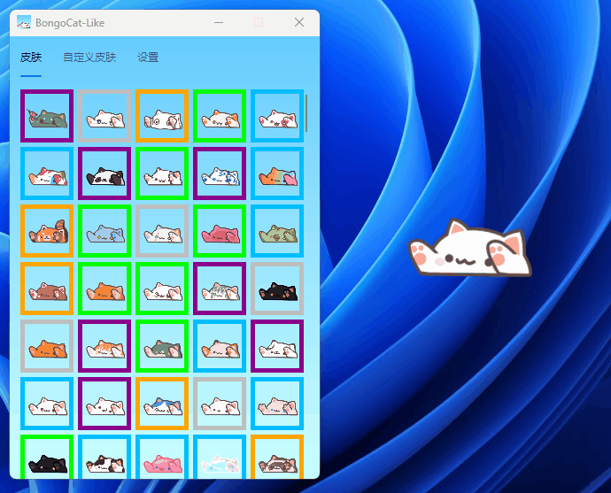

# 🐱 BongoCat 复刻版
一个轻量简洁不联网的桌面美化挂件，用来给你枯糙乏味的系统桌面添加一丝活气。

### 📑 简介

[BongoCat-Like](https://github.com/WLongSAMA/BongoCatLike) 是模仿 Steam 版 [BongoCat](https://store.steampowered.com/app/3419430/Bongo_Cat) 的样式，使用 C# 的 Avalonia 框架开发的一个全新的桌宠程序。这个项目中部分图像资源提取自原版程序，相关版权归原作者所有。

原版游戏需要长时间运行才能随机掉落新皮肤，集齐全部皮肤难度极大。为此，我重新开发了这个程序，不仅保留了敲屏幕小猫的可爱形象，还带来了愉快的换装体验。

这个项目不存在也不会添加 **挂机掉落机制** 和 **物品合成功能** ，并且它 **不需要** 依赖 Steam 客户端即可正常运行。

### ✨ 与原版的差异

1. 永久开源免费且不会加入广告
2. 不需要依赖 Steam 平台
3. 极低的资源占用，不会影响电脑的流畅度。
4. 跨平台运行，支持 Windows、Linux、MacOS
5. 默认包含全部皮肤，还支持自定义皮肤，可以绘制自己专属的小猫皮肤
6. ...

### 🛠️ 后续计划

1. 去中心化的局域网多人联机(使用虚拟局域网工具来跨网络联机)
2. 加入键盘皮肤，让小猫可以敲键盘
3. 加入插件功能，比如在小猫头上或下面显示日期时间、天气等等
4. 可以切换点击小猫时显示的文字
5. ...

### 🖥️ 关于联机

我还在开发这个复刻版的时候，就看到开发商的消息说要加入联机功能，心想就这么个东西怎么可能搞出联机功能...等多人联机真上线的时候，第一时间体验了一下，卧槽，还能这么玩，联机真的是太有意思了。

### 📚 关于开源

这个仓库使用 GPL 协议开源，一切基于本项目的衍生项目也 **必须开放源代码** ，希望有能力的朋友能为这个项目贡献一份力量。  
强制开源是因为这个项目包含了大量来自社区的素材，这些创意都是大家的，我不希望它们归于某个人所有。也请大家自觉抵制拿这个项目稍作修改就转手倒卖的黑心商家。  

这个程序不打算作为 BongoCat 的竞争者，应该把它看做是原版功能的补充，开发这个程序的初衷只是为了弥补它不能在我 Macbook 上运行的遗憾。  

**祝愿 BongoCat 的发展越来越好，感谢开发组的奇妙创意，世界如果没有小猫真的不行。**

### ❤️ 捐助

如果你也喜欢这个项目，欢迎与作者分享你喜欢的零食或饮料。

